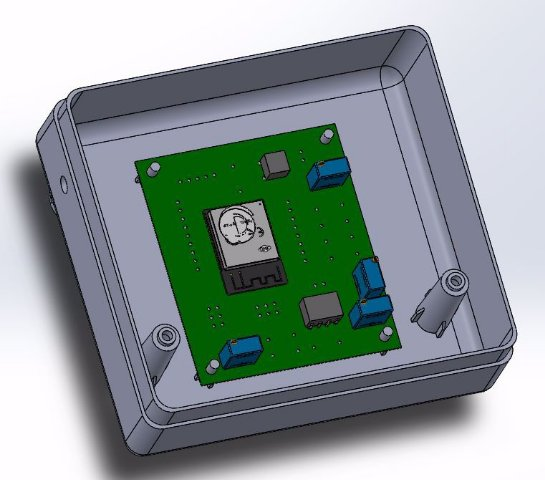
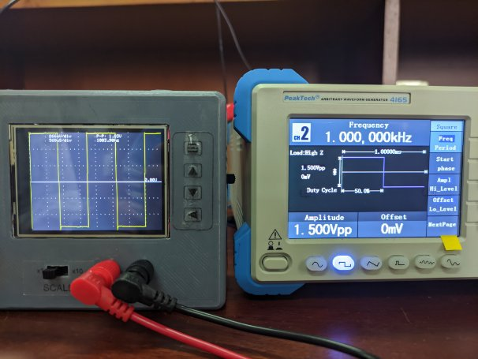

# Student Oscilloscope

## Abstract

Our goal of the project was to design and realize a marketable electronics-related project addressing an existing unsolved problem of current society. So we focused on a main problem that the majority of electronic and electrical students face now and then. That is the high cost of electronics testing equipment. We have decided to design an affordable yet accurate student electronic oscilloscope. Then technical aspects and feasibility were considered and put into test. A marketing plan also was carried out and a marketing survey was conducted to get ideas from the students and other potential customers. From that properly identified students’ needs and the most essential features that we must include in our student oscilloscope. This report contains details information on our student oscilloscope.

##  1. Introduction
### &emsp; 1.1 Background

Our main goal was to come up with a simple yet useful product that can address an unsolved problem. After a number of brainstorming sessions, we decided to design a budget-friendly student oscilloscope for the benefit of students and electronic hobbyists. Since the price of existing products was super high a market vacuum was there for our product.

### &emsp; 1.2. Problem Definition

As mentioned above since the testing equipment prices are so high students will always have to come into a lab to carry out their testing. But labs are not always available. Even if a multimeter could be used to get some measurements sometimes it’s essential to analyze the waveform and measure waveform parameters to properly understand what’s going on in the circuit.

### &emsp; 1.3. Objective

Our objective was to design an oscilloscope at an affordable price that has the main features of a professional oscilloscope.

### &emsp; 1.4. Product Features

- Measure waveform parameters - Can measure the waveform frequency, peak- to-peak voltage, maximum voltage, minimum voltage, and average voltage.
- Plot waveforms - Realtime plotting
- Auto-scaling - Automatically fit the input waveform shape to the LCD screen size. Therefore, users do not need to worry about manually scaling.
- Manual-scaling - The user can manually change the division size of voltage and time axes. Also, the user can shift the waveform vertically and horizontally.
- Filtering - Can apply a Low-pass filter or moving average filter to a given signal and see the waveform.

## 2. Design Procedure
### &emsp; 2.1. Methodology
1. Scale the measuring signal voltage to the input range.
2. Read the scaled input signal using ADC
2. Analyze the data signal and calculate the parameters
2. Plot the signal and display calculated data

### &emsp; 2.2. Circuit Design
#### &emsp;&emsp; 2.2.1. Voltage Scaling

ESP32 microcontroller only works in the 0 – 3.3V voltage range. Therefore we cannot directly give negative voltages to ESP32. Also, our design goal is to measure voltages up to 15V peak-to-peak. Therefore, we should scale down the input voltages and give DC offset such that it maps to 0 – 3.3V range. Here is the proposed design.

Our design has 2 scale selections i.e. x1 and x10. In x1 mode, it can measure signals with 1.5V peak-to-peak, and in x10 mode, it can measure signals with 15V peak-to-peak. The first opamp is used to scale down the input voltage. Here R6 and R7 variable resistors are tuned in such a way that, in x1 mode gain equals 1 and in x10 mode gain equals 0.1. The second opamp is used to give DC offset of 0.75V to scaled-down input. Therefore, ADC input to ESP32 is within the 0-3.3V range.

Since we are working with high-frequency signals, opamps should have a high slew rate. Also, the ESP32 microcontroller works in 3.3V, therefore opamps should be able to drive with a 3.3V dual power supply. Considering the above requirements, we selected LM358 opamp.

Since this is a measuring device we need to preciously calibrate our device. So we used top-adjust circular-track multi-turn trimpots which have higher resolution than normal variable resistors.

#### &emsp;&emsp; 2.2.2. Microcontroller Unit

The critical component of this design is the microcontroller having an ADC which is ca- pable of a high sampling rate. Also, it should have enough memory to store a considerable amount of samples. It should have at least two cores to read sampling data while ana- lyzing data and driving the display. Since our goal is to build a low-cost oscilloscope it should be cheap. After considering all the requirements, we selected the ESP32 WROOM 32 chip as our main microcontroller. It is a Dual-core 32-bit with 80 MHz frequency and it has a sampling rate of 2 MSPS.

#### &emsp;&emsp; 2.2.3. Display

For displaying waveforms and parameters we used a 2.8’ 240x320 colour TFT LCD with an inbuilt display controller. The display controller supports the SPI interface.

#### &emsp;&emsp; 2.2.3. PCB Design

Using Altium we designed an optimised double-layer PCB with a 60x70 mm dimension. The ESP32 chip is an SMD component and all other components are through holes. The PCB was printed in JLCPCB in china and assembled by ourselves.

#### &emsp;&emsp; 2.2.4. Enclosure Design

The goal of the design was to create a compact and user-friendly device that is easy to hold and operate, while also being cost-effective to produce.

##### &emsp;&emsp;&emsp; 2.2.4.1. Design Considerations

The dimensions of the enclosure were determined to be 110mm in length, 100mm in width, and 55mm in height. The primary objective was to minimize the size of the enclosure to reduce production costs. The enclosure was designed in a way that the device can be easily and tightly held by a single hand, making it more user-friendly.

The display of the oscilloscope was positioned in such a way that when the device is placed on a flat surface, the top surface with the display is not parallel to the flat surface. Instead, it is tilted towards the user, allowing for a more comfortable viewing of the display. The controlling buttons and the scale-changing switch were placed around the display, making them easily accessible to the user.

The power on/off button and reset button were placed on the right side of the enclosure. This was done because the operation of these buttons differs from the main controlling buttons, and placing them on the right side makes them easily accessible to the user.

##### &emsp;&emsp;&emsp; 2.2.4.1.2. Future Upgrades

In future upgrades of the product, we aim to reduce the height of the device by 50%. This will make the device even more portable and cost-effective.

##### &emsp;&emsp;&emsp; 2.2.4.1.3. Conclusion

The enclosure design for this low-cost portable oscilloscope was developed with the goal of creating a compact, user-friendly device that is easy to hold and operate, while also being cost-effective to produce. By tilting the display towards the user and placing the controlling buttons and scale changing switch around the display, the device is more comfortable to use. The placement of the power on/off and reset buttons on the right side make it easily accessible to the user. Future upgrades of the product aim to decrease the height of the device by 50%, making it even more portable and cost-effective.

#### &emsp;&emsp; 2.2.5. Firmware Design

ESP32 contains 2 cores. We used one core to operate ADC and sample the input voltage signal. It loads the ADC data into a buffer. This buffer is shared between 2 cores. In the second core, all the data analysing algorithms are running, driving the display, and responding to user interactions. We used an available 3rd party DSP library to analyse the signal data and calculate signal parameters like Vmax, Vmin, Vpp, Mean, Frequency etc. The reverse process of scaling hardware is applied to the calculated parameters before displaying. We used an available 3rd party graphic library to generate display graphics with waveform plots and calculated data. All the display data is sent to the display using an SPI interface. Displaying menu was included to select available features. 4 push buttons were used to navigate and change or apply features in that menu. Interrupts were used to catch up button press events.

## 3  Testing

First, we used an industrial-grade oscilloscope to tune the values of the variable resistors in the scaling circuit. After that, we used an industrial-grade function generator to generate different types of signal waves and see the functionalities of our design. Here are some snapshots of testing.

## 4  Final Product

## User Manual

PORTABLE OSCILLOSCOPE FOR STUDENTS  

Introduction 

A digital oscilloscope is an essential tool for measuring and analyzing electrical signals in a variety of applications. It is equipped with advanced features that make it easy to capture, display, and analyze signals. Our portable digital oscilloscope is designed for students who are interested in electronics and related fields but may not have access to a more expensive oscilloscope. This user manual will guide you through the setup, operation, and maintenance of the portable digital oscilloscope. 

Safety Precautions 

- Always follow proper safety procedures when using the portable oscilloscope. 
- Always make sure that the probe is connected securely to the oscilloscope before use. 
- Always make sure that the probe tip is in contact with the correct point on the circuit before making a measurement. 
- Always make sure that the oscilloscope is in the correct voltage range before making a measurement. 
- Always make sure that the oscilloscope is in the correct scale before making a measurement. 
- Always make sure that the oscilloscope is turned off and unplugged before cleaning or performing maintenance. 
- Always make sure that the oscilloscope is handled with care, to avoid any physical damage. 

Getting Started 

- Connect the power adaptor and turn on the device by pressing the ‘power on switch’ 
- Connect the probe to the oscilloscope
- Select the proper manual scale or auto-scale for the measurement you wish to take

Measurements 

- Select the appropriate scale (manual or auto-scale) for the measurement you wish to take
- Place the probes appropriately on the circuit
- Adjust the settings as needed, such as time base and voltage scale
- Take the measurement and analyze the results

Features 

- Auto-scale - automatically adjust the time width and the amplitude width according to the given input signal
- Manual scale -manually adjust the time width and the amplitude width as user prefer
- Filters – user can apply low-pass filter, moving average filter

Maintenance and Troubleshooting 

- Always unplug the oscilloscope when it is not in use
- Use the largest voltage range when measuring unknown voltages
- Always try to measure voltages within the recommended range for the oscilloscope
- If the display is white and not displaying any information, press the reset button

Refer to this user manual for further troubleshooting tips or contact the manufacturer for technical support. 

Technical Specifications 

- Analog bandwidth: 0 - 15kHz
- Sampling rate: 1Msps max
- Sensitivity: 50mV/Div – 500mV/Div
- Vertical resolution: 12-bit
- Time base: 50us/Div – 5000us/Div
- LCD: 2.8" color TFT LCD, 320 x 240
- Record length: 1000 points
- Auto-set function
- Power supply: DC 3.3V

## Members

<pre>
+-----------+----------------------+
|   Index   |         Name         |   
+-----------+----------------------+
|  190018V  | K.C.S. Abeywickrama  | 
|  190622R  | O.K.D. Tharindu      | 
|  190648C  | K.S.S. Vikasitha     |
|  190712T  | D.R.R.T. Wijesuriya  |
+-----------+----------------------+
</pre>

